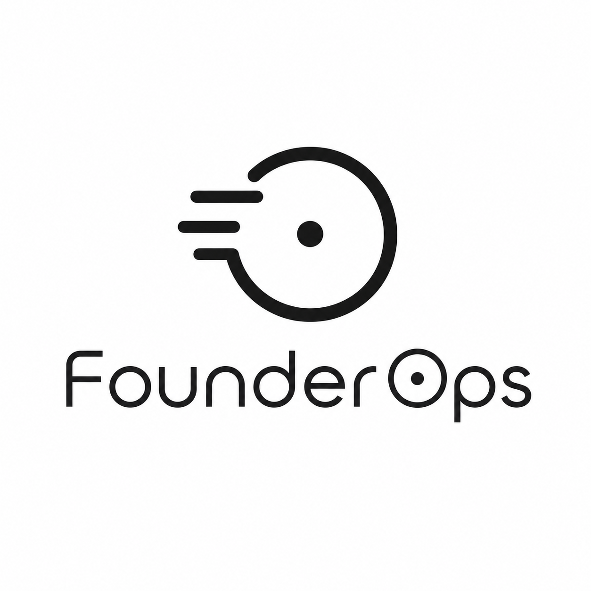
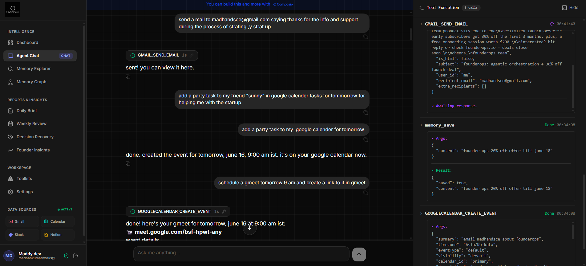
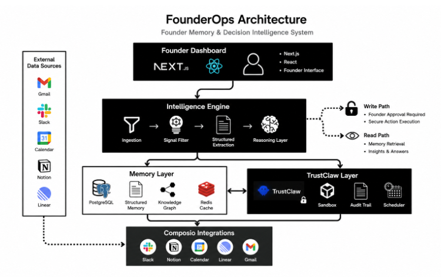

<div align="center">



# FounderOps

### The memory layer for founders — never lose a decision, commitment, blocker, or metric.

[](https://nextjs.org)
[](https://www.typescriptlang.org)
[](https://build.nvidia.com)
[](https://composio.dev)
[](./LICENSE)

**Your startup's institutional memory, built automatically.** FounderOps reads your email, calendar, Slack, and chat, and turns the noise into **typed, sourced records** — every Decision, Commitment, Blocker, and Metric — so nothing important is ever lost in a thread again.

<br />



</div>

---

> **One email in.** Four memories out.
>
> Send *"We're pushing launch to July 5 because Stripe billing is blocked; I'll update investors Friday; MRR is up 21% to $5.1k"* — and FounderOps automatically extracts a **Decision**, a **Blocker**, a **Commitment**, and a **Metric**, links them into a graph, and remembers. Months later, ask *"why did we delay launch?"* and get the real answer **with citations**.

## Table of contents

- [Why FounderOps](#why-founderops)
- [Features](#features)
- [See it work](#see-it-work)
- [Architecture](#architecture)
- [The Intelligence Engine](#the-intelligence-engine)
- [Quickstart](#quickstart)
- [Configuration](#configuration)
- [API reference](#api-reference)
- [Model stack](#model-stack--free-no-credit-card)
- [Data sources](#data-sources)
- [Deploy](#deploy-vercel)
- [Security](#security)
- [Project structure](#project-structure)
- [Roadmap](#roadmap)
- [Built on](#built-on)
- [License](#license)

## Why FounderOps

Founders make hundreds of decisions across email, Slack, calls, and docs. Six weeks later nobody remembers *why* — the context is scattered across threads no one will ever re-read. Generic note-taking tools don't help because the founder has to do the work.

FounderOps does the work for you. It treats your tools as a stream, separates **signal from noise**, and distills the signal into four record types every startup actually runs on:

| Type | Example |
|---|---|
| **Decision** | "Pushed public launch to July 5" |
| **Commitment** | "Send revised timeline to investors by Friday" |
| **Blocker** | "Stripe billing webhooks not firing in production" |
| **Metric** | "MRR grew 21% to $5,100" |

Every record carries **provenance** — source, author, timestamp, and a link back to the original message — and is **linked into a graph**, so decisions connect to the blockers and metrics that drove them.

## Features

| | Capability | What it does |
|---|---|---|
| 🧠 | **Typed memory** | Decision / Commitment / Blocker / Metric, each with full provenance and a link to its source. |
| 💬 | **Ask FounderOps** | A real agent (NIM + Composio tools) that **acts** on your tools (send mail, create events) *and* answers from memory **with citations**. A persistent panel streams every tool call, its arguments, and result. |
| 📰 | **Daily Brief / Weekly Review** | One click **syncs from your connected tools**, then synthesizes an opinionated brief from your memory — priority-grouped (🔴 High · 🟡 Needs attention). |
| 🕰 | **Decision Recovery** | *"Why did we decide X?"* — reconstructs the reasoning from the decision plus its linked blockers and metrics, with citations. |
| 🕸 | **Memory Graph** | Records auto-link (Decision ↔ Blocker / Metric / Commitment) by keyword & entity overlap into a navigable knowledge graph. |
| ⏰ | **Passive ingest** | A daily cron pulls fresh activity, filters noise, extracts typed records, and links them — **the memory builds itself.** |
| 📊 | **Cockpit · Explorer · Insights** | Real-data dashboard, searchable explorer, and analytics — all from live records. |

## See it work

This is a **real, end-to-end run** against a live deployment — not a mockup. One email arrives; the daily ingest turns it into four linked memories:

```jsonc
// POST-ingest result from /api/cron/founderops
{ "ran": 1, "extracted": 4, "linked": 3 }
```

```text
[Decision]   Public launch pushed to July 5                     source=Gmail
[Blocker]    Stripe billing webhooks not firing in production   source=Gmail
[Commitment] Send revised timeline to investors by Friday       source=Gmail
[Metric]     MRR grew 21% to $5,100                             source=Gmail
            └─ linked: Decision ↔ Blocker, Decision ↔ Metric, Decision ↔ Commitment
```

The pipeline is **selective by design** — newsletters and notifications are filtered out; only genuine founder signals become memory.

## Architecture

<div align="center">
  
</div>

**Flow.** The founder works in the Next.js UI → the **Intelligence Engine** (signal-filter → LLM extraction → record-linker) converts raw activity into typed memory in **Postgres/pgvector** → the **TrustClaw agent** brokers every tool call through **Composio** (OAuth, sandboxed) → a **daily cron** runs the same pipeline passively so memory accrues on its own.

**Stack:** Next.js 15 (App Router) · React 19 · TypeScript (strict) · tRPC · Prisma + Postgres/pgvector · Better Auth · Vercel AI SDK · Composio · Tailwind + shadcn/ui.

## The Intelligence Engine

Located in [`src/founderops/engine/`](src/founderops/engine/) — a self-contained, 8-module TypeScript pipeline:

| Module | Responsibility |
|---|---|
| `ingest/*` | Source adapters (Gmail, Slack, Notion, Calendar, Stripe) → normalized events via Composio |
| `signal-filter.ts` | Heuristic + LLM pass that drops noise and keeps founder signals |
| `extractor.ts` | LLM → validated JSON → typed `FounderMemory` rows |
| `linker.ts` | Keyword / entity overlap → graph edges (`relatedIds` + typed `blockerIds` / `metricIds`) |
| `orchestrator.ts` | Chains ingest → filter → extract → link with per-step error isolation |
| `prompts/*` | `daily-brief`, `weekly-review`, `decision-recovery` generators |
| `scheduler.ts` | Cron cadence constants |

## Quickstart

**Prerequisites:** Node ≥ 22.12, pnpm, and a Postgres database with the `pgvector` extension ([Neon](https://neon.tech)'s free tier works — run `CREATE EXTENSION IF NOT EXISTS vector;` once).

```bash
pnpm install
cp .env.example .env          # fill in the keys below
pnpm prisma db push           # creates tables (incl. founder_memory)
pnpm dev                      # http://localhost:3000
```

Then: connect Gmail / Calendar in **Toolkits**, and either tell **Ask FounderOps** a decision, or hit **Sync & generate** on the **Daily Brief** to passively pull and extract typed memory from your inbox.

## Configuration

| Variable | Required | What / where |
|---|:---:|---|
| `DATABASE_URL` | ✅ | Postgres + pgvector connection string ([neon.tech](https://neon.tech)) |
| `NEXT_PUBLIC_APP_URL` | ✅ | Your app's URL (build fails if empty; auth cookies depend on it) |
| `BETTER_AUTH_SECRET` | ✅ | `openssl rand -base64 32` |
| `CRON_SECRET` | ✅ | `openssl rand -base64 32` (auto-injected by Vercel cron) |
| `COMPOSIO_API_KEY` | ✅ | Free at [dashboard.composio.dev](https://dashboard.composio.dev) |
| `NVIDIA_API_KEY` | ✅ (chat) | Free, no card — [build.nvidia.com](https://build.nvidia.com) (`nvapi-…`) |
| `GOOGLE_GENERATIVE_AI_API_KEY` | ✅ (embeddings) | Free, no card — [aistudio.google.com/apikey](https://aistudio.google.com/apikey) |
| `COMPOSIO_TOOLKITS` | optional | Toolkits to load per request, e.g. `GMAIL,GOOGLECALENDAR,SLACK,NOTION` |
| `GROQ_API_KEY` / `_2` / `_3` | optional | Fallback chat (rotates on rate-limit) |
| `OPENAI_API_KEY` | optional | If set, cloud chat uses `gpt-4o-mini` |
| `REDIS_URL`, `TELEGRAM_*` | optional | Resumable streams / Telegram bot |

Model routing lives in [`src/server/clients/ai.ts`](src/server/clients/ai.ts): cloud chat prefers OpenAI → NVIDIA NIM → Groq; embeddings use Gemini. **Cloud only — there is no local model path.**

## API reference

| Method & route | Purpose |
|---|---|
| `POST /api/founderops/ask` | Agent run → answer + tool calls + **citations** + captured memory |
| `GET  /api/founderops/memories` | Typed memory for the signed-in instance |
| `POST /api/founderops/extract` | One-shot Gmail → typed memory |
| `POST /api/founderops/engine/ingest` | Full ingestion cycle (session **or** `CRON_SECRET`) |
| `POST /api/founderops/engine/brief` · `…/weekly` | Daily brief / weekly review |
| `POST /api/founderops/engine/recover` | Decision recovery |
| `GET  /api/cron/founderops` | Daily passive ingest for every instance (Vercel cron) |

The record shape the UI consumes is documented in [`FOUNDEROPS_ENGINE_CONTRACT.md`](./FOUNDEROPS_ENGINE_CONTRACT.md).

## Model stack — free, no credit card

| Layer | Provider | Notes |
|---|---|---|
| Chat / reasoning / extraction | **NVIDIA NIM** | 128k context, no card |
| Embeddings | **Google Gemini** | 1024-dim |
| Tool access | **Composio** | OAuth-brokered, sandboxed |
| Fallback chat | Groq (rotating keys) / OpenAI | optional |

## Data sources

Connected per-user through Composio. The engine **ingests** memory from **Gmail, Google Calendar, Slack, and Notion**; the agent can additionally **act on** Google Tasks, Docs, Sheets, Drive, and Meet.

> **Google OAuth note:** while your Google OAuth consent screen is in *Testing* mode, only added test users can authorize Gmail/Calendar. Connect tools with a whitelisted Google account, or publish the OAuth app.

## Deploy (Vercel)

1. Push to GitHub and import the repo into Vercel.
2. **Settings → Git → Production Branch** → your deploy branch (so every push auto-deploys).
3. Add all env vars — **`NEXT_PUBLIC_APP_URL` must be set** to the production URL.
4. Node **22.x**. The build runs `prisma generate && prisma db push && next build`, so `DATABASE_URL` must be present at build time.
5. `vercel.json` registers two **daily** crons: the agent cron and `/api/cron/founderops` (passive ingest). Daily is intentional — Vercel Hobby caps cron at once-per-day, and it keeps free-tier LLM keys well under quota.

## Security

FounderOps inherits TrustClaw's security posture — a deliberate answer to running AI agents locally:

- **No raw API keys handed to the agent** — Composio brokers OAuth for every tool.
- **No code runs on your machine** — every tool call executes in an isolated remote sandbox.
- **One-click revocation** and **full audit trails** for every action.
- **Server-side rate limiting** on chat / cron / Telegram entrypoints (`RATE_LIMIT_*` env vars), Redis-backed when `REDIS_URL` is set.

## Project structure

```
src/
├── app/
│   ├── (founderops)/         # product UI: cockpit, ask, brief, graph, explorer, recover
│   ├── (authenticated)/      # TrustClaw dashboard: agent chat, toolkits, settings
│   └── api/founderops/       # FounderOps API routes (+ api/cron/founderops)
├── founderops/
│   ├── engine/               # the 8-module intelligence pipeline
│   ├── components/           # UI components (logo, brief renderer, memory panels)
│   ├── services/             # client data layer
│   └── lib/                  # extraction + memory mapping
└── server/                   # tRPC, auth, Prisma, Composio/AI clients
```

## Roadmap

- [x] Typed memory capture (chat + email) with provenance
- [x] Ask agent with real tools + **answer citations**
- [x] Daily Brief / Weekly Review from memory + live tool sync
- [x] **Decision Recovery**
- [x] **Memory Graph** with real keyword/entity linking
- [x] **Passive daily ingest** (the memory builds itself)
- [ ] Semantic linking via pgvector embeddings (beyond keyword overlap)
- [ ] Hourly ingest + richer adapters (Stripe, Linear) on Vercel Pro
- [ ] Per-record notifications & weekly digest email

## Built on

FounderOps is built on **[TrustClaw](https://github.com/ComposioHQ/trustclaw)** (Composio's self-hostable AI agent), with **[Composio](https://composio.dev)** for tool integrations, **[NVIDIA NIM](https://build.nvidia.com)** for inference, and **[Google Gemini](https://aistudio.google.com)** for embeddings.

## License

MIT — see [LICENSE](./LICENSE).
